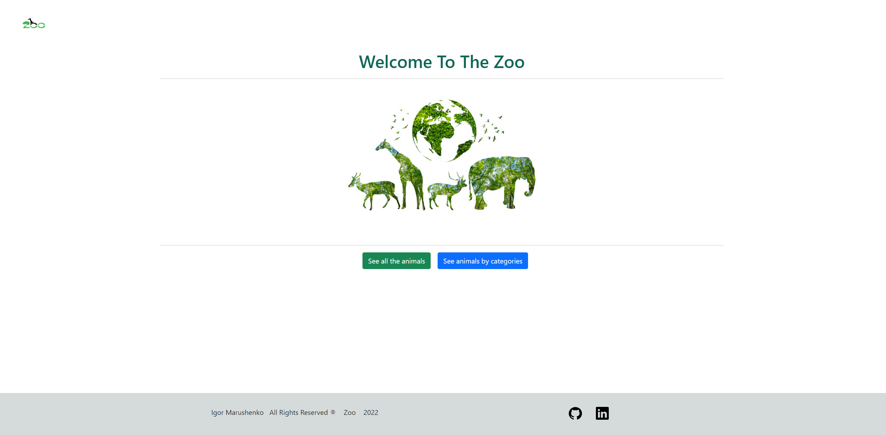
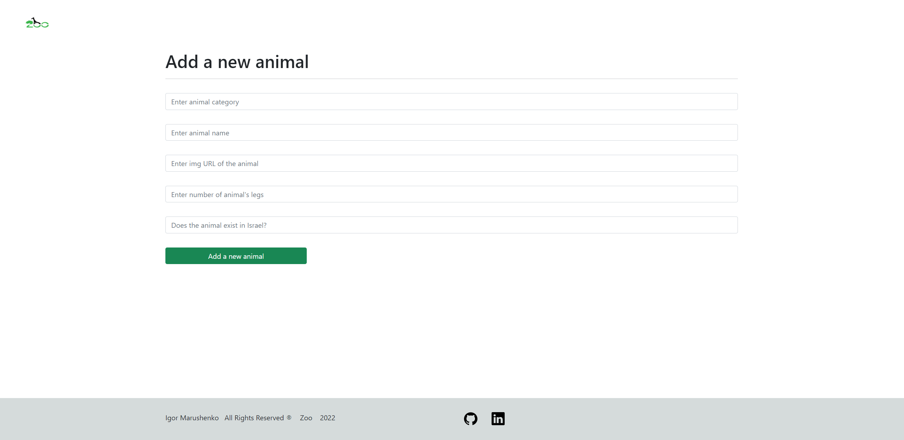
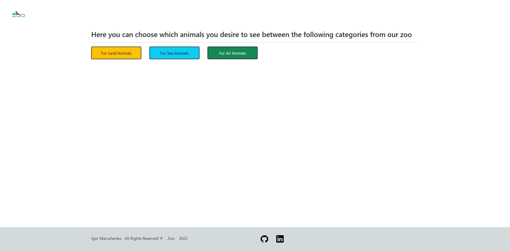
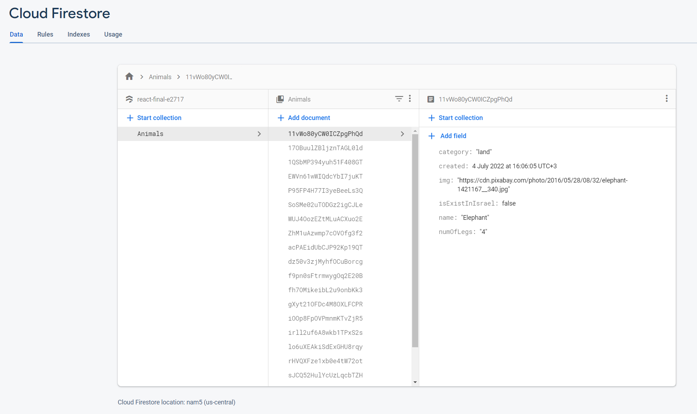

<h1>React Zoo App</h1>

<h1>Teachnologies:</h1>
<h3>Javascript</h3>
<h3>React</h3>
<h3>HTML</h3>
<h3>CSS</h3>
<h3>Bootstrap</h3>
<h3>Firebase - Firestore</h3>

<h1>In this app you can see all the animals in the web zoo, you can manage the zoo by editing, deleting or add animals</h1>

<h1>Homepage</h1>

<h1>Animals list & "Add a new animal" button</h1>

<h1>Animals list - Continuation of the page</h1>

<h1>Animals list - Continuation of the page</h1>

<h1>Add an animal page</h1>

<h1>See animals by category</h1>

<h1>All the data - Firestore cloud of Google's Firebase</h1>

 
 
<h1>Made By Igor Marushenko</h1>
<h1>Thank you for your visit !</h1>